# Silhouette Package

## Introduction

The Silhouette package provides a comprehensive and extensible framework
for computing and visualizing silhouette widths to assess clustering
quality in both crisp (hard) and soft (fuzzy/probabilistic) clustering
settings. Silhouette width, originally introduced by Rousseeuw (1987),
quantifies how similar an observation is to its assigned cluster
relative to the closest alternative cluster. Scores range from -1
(indicative of poor clustering) to 1 (excellent separation).

*Note:* This package does not use the classical Rousseeuw (1987)
calculation directly. Instead, it generalizes and extends silhouette
methodology as follows:

- Implements the Simplified Silhouette method (Van der Laan et al.
  2003), with options for medoid or pac (Probability of Alternative
  Cluster, Raymaekers and Rousseeuw (2022)) approaches.
- Provides soft clustering silhouettes based on membership probabilities
  (Campello and Hruschka 2006; Bhat Kapu and Kiruthika 2024), including
  density-based diagnostics like certainty and density-based
  silhouettes.
- Includes density-based silhouette (dbSilhouette) computation, which
  leverages log-ratios of posterior probabilities for soft clustering
  evaluation (Menardi 2011).
- Supports calculation of crisp, fuzzy, and median silhouette widths,
  allowing flexible averaging methods to suit different clustering
  needs.
- Supports multi-way clustering evaluation via extSilhouette() (Schepers
  et al. 2008), enabling silhouette analysis for biclustering or
  higher-order tensor clustering. Offers customizable and informative
  visualization with plotSilhouette(), including grayscale options and
  detailed cluster legends. The package also integrates with clustering
  results from popular R packages such as cluster (silhouette, pam,
  clara, fanny) and factoextra (eclust, hcut).
- Includes utility functions for creating and validating Silhouette
  objects directly from components.

This vignette demonstrates the essential features of the package using
the well-known iris dataset. It showcases both standard (crisp) and
fuzzy silhouette calculations, advanced plotting capabilities, and
extended silhouette metrics for multi-way clustering scenarios.

### Available Functions

**[`Silhouette()`](https://kskbhat.github.io/Silhouette/reference/Silhouette.md)**:
Calculates silhouette widths for both crisp and fuzzy clustering, using
user-supplied proximity matrices.

**[`softSilhouette()`](https://kskbhat.github.io/Silhouette/reference/softSilhouette.md)**:
Computes silhouette widths tailored to soft clustering by interpreting
membership probabilities as proximities.

**[`dbSilhouette()`](https://kskbhat.github.io/Silhouette/reference/dbSilhouette.md)**:
Computes density-based silhouette widths for soft clustering, based on
log-ratios of posterior probabilities.

**[`cerSilhouette()`](https://kskbhat.github.io/Silhouette/reference/cerSilhouette.md)**:
Computes certainty silhouette widths for soft clustering, using the
maximum posterior probabilities as silhouette values.

- **[`calSilhouette()`](https://kskbhat.github.io/Silhouette/reference/calSilhouette.md)**  
  Computes all available silhouette indices from the package functions
  and returns a comparative summary data frame. Automatically calculates
  crisp, fuzzy, and median silhouette values across different methods
  including proximity-based (medoid, pac), soft silhouette variations
  (pp_pac, pp_medoid, nlpp_pac, nlpp_medoid, pd_pac, pd_medoid), and
  probability-based methods (cer, db). Supports direct matrix input or
  clustering function output for streamlined comparative analysis.

**[`getSilhouette()`](https://kskbhat.github.io/Silhouette/reference/getSilhouette.md)**:
Constructs a Silhouette class object directly from user-provided
components (e.g., cluster assignments, neighbor clusters, silhouette
widths).

**[`is.Silhouette()`](https://kskbhat.github.io/Silhouette/reference/is.Silhouette.md)**:
Tests whether an object is of class “Silhouette”, with optional strict
structural validation.

**`plot() / plotSilhouette()`**: Visualizes silhouette widths as sorted
bar plots, offering grayscale and flexible legend options for clarity.

**[`summary()`](https://rdrr.io/r/base/summary.html)**: Produces concise
summaries of average silhouette widths and cluster sizes for objects of
class Silhouette.

**[`extSilhouette()`](https://kskbhat.github.io/Silhouette/reference/extSilhouette.md)**:
Derives extended silhouette widths for multi-way clustering problems,
such as biclustering or tensor clustering.

## Use Cases

### 1. Simplified Silhouette Calculation

#### a. When the Proximity Matrix is Unknown but Centers of Clusters Are Known

This example demonstrates how to compute silhouette widths for a
clustering result when you have the proximity (distance) matrix between
observations and cluster centres unknown. The workflow uses the classic
`iris` dataset and k-means clustering.

**Steps:**

- **Clustering**: Perform k-means clustering on `iris[, -5]` with 3
  clusters.

``` r

data(iris)
km <- kmeans(iris[, -5], centers = 3)
```

*Note*: The `kmeans` output (`km`) does not include a proximity matrix.
Therefore, distances between observations and cluster centroids must be
computed separately.

- **Compute the Proximity Matrix**:  
  Create a matrix of distances between each observation and cluster
  centroid using `proxy::dist()`.

``` r

library(proxy)
dist_matrix <- proxy::dist(iris[, -5], km$centers)
sil <- Silhouette(dist_matrix)
head(sil)
#>   cluster neighbor sil_width
#> 1       1        2 0.9586603
#> 2       1        2 0.8682865
#> 3       1        2 0.8831417
#> 4       1        2 0.8465006
#> 5       1        2 0.9455979
#> 6       1        2 0.7848442
summary(sil)
#> -----------------------------------------------------
#> Average crisp dissimilarity medoid silhouette: 0.6664
#> -----------------------------------------------------
#> 
#>   cluster size avg.sil.width
#> 1       1   50        0.8592
#> 2       2   62        0.5546
#> 3       3   38        0.5950
plot(sil)
```


- **Customize Calculation**:  
  To use the Probability of Alternative Cluster (PAC) method (which is
  more penalised variation of medoid method) and return a sorted output:

``` r

sil_pac <- Silhouette(dist_matrix, method = "pac", sort = TRUE)
head(sil_pac)
#>    cluster neighbor sil_width
#> 8        1        2 0.9611009
#> 40       1        2 0.9329754
#> 1        1        2 0.9206029
#> 18       1        2 0.9182947
#> 50       1        2 0.9158517
#> 41       1        2 0.8993130
summary(sil_pac)
#> --------------------------------------------------
#> Average crisp dissimilarity pac silhouette: 0.5376
#> --------------------------------------------------
#> 
#>   cluster size avg.sil.width
#> 1       1   50        0.7603
#> 2       2   62        0.4136
#> 3       3   38        0.4468
plot(sil_pac)
```

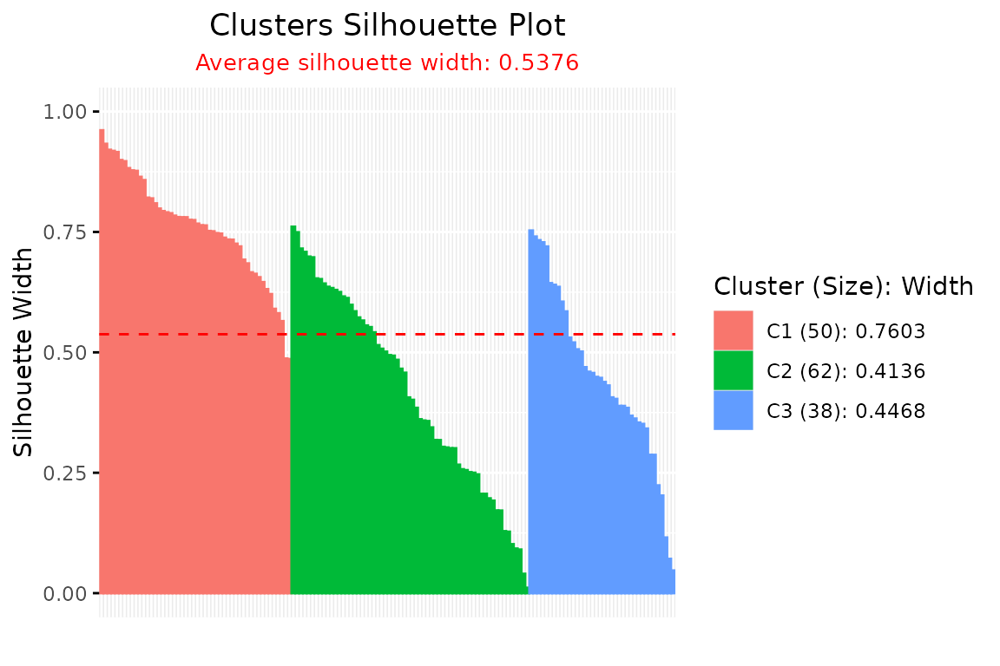

- **Accessing Silhouette Summaries**:  
  The `Silhouette` function prints overall and cluster-wise silhouette
  indices to the R console if `print.summary = TRUE`, but these values
  are not directly stored in the returned object. To extract them
  programmatically, use the
  [`summary()`](https://rdrr.io/r/base/summary.html) function:

``` r

s <- summary(sil_pac,print.summary = TRUE)
#> --------------------------------------------------
#> Average crisp dissimilarity pac silhouette: 0.5376
#> --------------------------------------------------
#> 
#>   cluster size avg.sil.width
#> 1       1   50        0.7603
#> 2       2   62        0.4136
#> 3       3   38        0.4468
# summary table
s$sil.sum
#>   cluster size avg.sil.width
#> 1       1   50        0.7603
#> 2       2   62        0.4136
#> 3       3   38        0.4468
# cluster wise silhouette widths
s$clus.avg.widths
#>         1         2         3 
#> 0.7602929 0.4136203 0.4468368
# Overall average silhouette width
s$avg.width
#> [1] 0.5375927
```

#### b. When the Proximity Matrix Is Known

This section describes how to compute silhouette widths when the
**proximity matrix**—representing distances between observations and
cluster centers—is readily available as part of the clustering model
output. The example makes use of fuzzy c-means clustering via the
`ppclust` package and the classic `iris` dataset.

**Steps:**

- **Step 1: Perform Fuzzy C-Means Clustering**  
  Apply fuzzy c-means clustering on `iris[, -5]` to create three
  clusters.

``` r

library(ppclust)
data(iris)
fm <- ppclust::fcm(x = iris[, -5], centers = 3)
```

- **Step 2: Compute Silhouette Widths Using the Proximity Matrix**  
  The output object `fm` contains a distance matrix `fm$d` representing
  proximities between each observation and each cluster center, which
  can be directly fed to the
  [`Silhouette()`](https://kskbhat.github.io/Silhouette/reference/Silhouette.md)
  function.

``` r

sil_fm <- Silhouette(fm$d)
plot(sil_fm)
```


- **Alternative: Directly Use the Clustering Function with
  `clust_fun`**  
  To streamline the workflow, you can let the
  [`Silhouette()`](https://kskbhat.github.io/Silhouette/reference/Silhouette.md)
  function internally handle both clustering and silhouette calculation
  by supplying the name of the distance matrix (`"d"`) and the desired
  clustering function:

``` r

sil_fcm <- Silhouette(prox_matrix = "d", clust_fun = fcm, x = iris[, -5], centers = 3)
plot(sil_fcm)
```

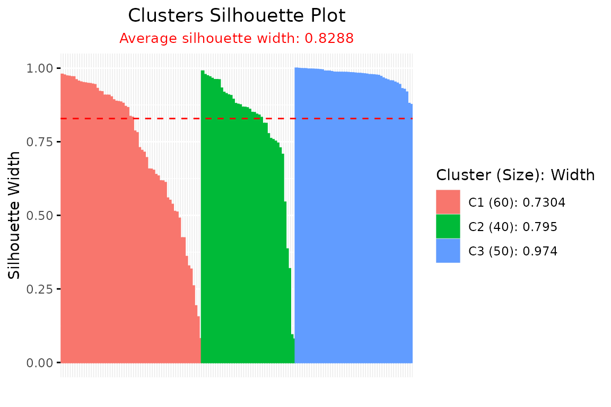

This approach eliminates the explicit step of extracting the proximity
matrix, making analyses more concise.

**Summary:**  
When the proximity matrix is provided directly by a clustering algorithm
(as with fuzzy c-means), silhouette widths can be calculated in one
step. For further convenience, the
[`Silhouette()`](https://kskbhat.github.io/Silhouette/reference/Silhouette.md)
function accepts both the proximity matrix and a clustering function, so
that a single command completes the clustering and computes silhouettes.
This greatly simplifies the process for methods with built-in proximity
outputs, supporting rapid and reproducible evaluation of clustering
separation and quality.

#### c. Calculation of Fuzzy Silhouette Index for Soft Clustering Algorithms

This section explains how to compute the fuzzy silhouette index when
both the **proximity matrix** (distances from observations to cluster
centers) and the **membership probability matrix** are available. The
process is demonstrated with fuzzy c-means clustering from the `ppclust`
package applied to the classic `iris` dataset.

**Steps:**

- **Step 1: Perform Fuzzy C-Means Clustering**  
  Apply fuzzy c-means clustering to the feature columns of the `iris`
  dataset, specifying three clusters:

``` r

data(iris)
fm1 <- ppclust::fcm(x = iris[, -5], centers = 3)
```

- **Step 2: Compute Fuzzy Silhouette Widths Using Proximity and
  Membership Matrices**  
  The clustering output `fm1` contains both the distance matrix
  (`fm1$d`) and the membership probability matrix (`fm1$u`) and
  `average = "fuzzy"`. These can be directly passed to the
  [`Silhouette()`](https://kskbhat.github.io/Silhouette/reference/Silhouette.md)
  function to compute fuzzy silhouette widths:

``` r

sil_fm1 <- Silhouette(prox_matrix = fm1$d, prob_matrix = fm1$u, average = "fuzzy")
plot(sil_fm1)
```

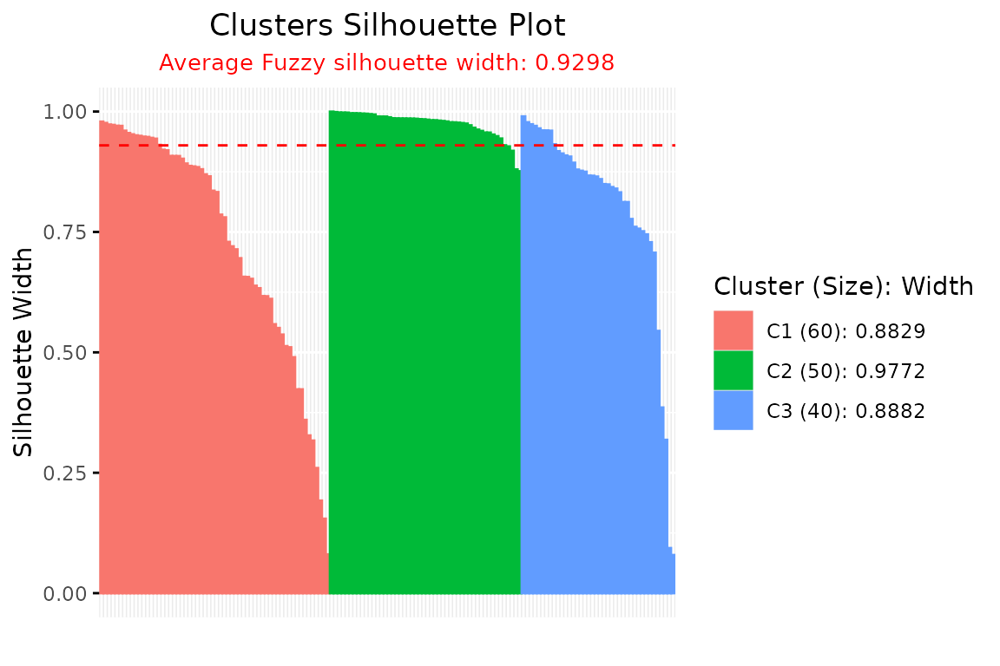

- **Alternative: Use Clustering Function Inline with `clust_fun`**  
  For an even more streamlined workflow, the
  [`Silhouette()`](https://kskbhat.github.io/Silhouette/reference/Silhouette.md)
  function can internally manage clustering and silhouette calculations
  by accepting the names of the distance and probability components
  (`"d"` and `"u"`) along with the clustering function:

``` r

library(ppclust)
sil_fcm1 <- Silhouette(prox_matrix = "d", prob_matrix = "u", average = "fuzzy", clust_fun = fcm, x = iris[, -5], centers = 3)
plot(sil_fcm1)
```

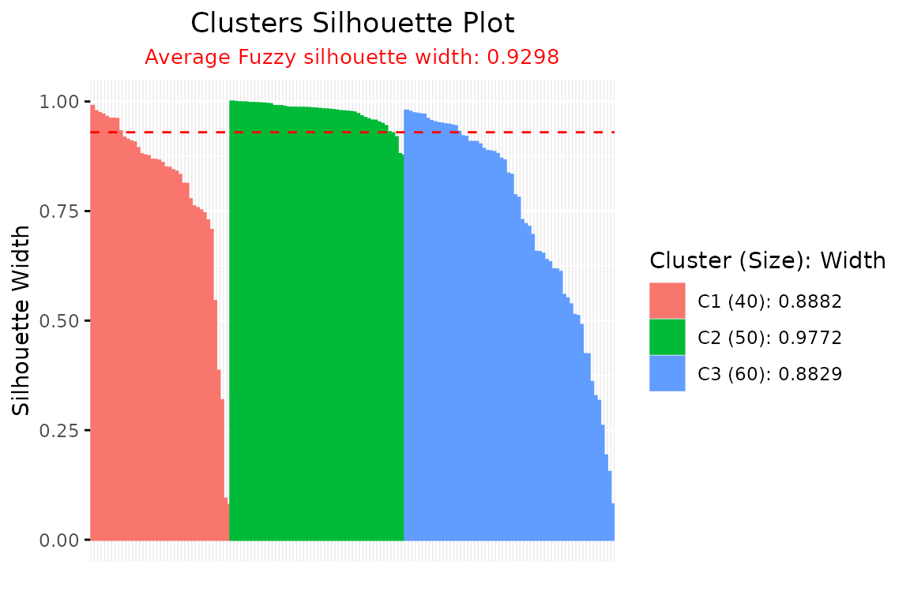

This approach removes the need to manually extract matrices from the
clustering result, improving code efficiency and reproducibility.

**Summary:**  
When both the proximity and membership probability matrices are directly
available from a clustering algorithm (such as fuzzy c-means), fuzzy
silhouette widths can be calculated efficiently in a single step. The
[`Silhouette()`](https://kskbhat.github.io/Silhouette/reference/Silhouette.md)
function further supports an integrated workflow by running both the
clustering and silhouette calculations internally when provided with the
relevant function and argument names. This functionality facilitates a
concise, reproducible pipeline for validating the quality and separation
of soft clustering results.

### 2. Comparing Two Soft Clustering Algorithms Using the Soft Silhouette Function

It is often desirable to assess and compare the clustering quality of
different soft clustering algorithms on the same dataset. The **soft
silhouette index** offers a principled, internal measure for this
purpose, as it naturally incorporates the probabilistic nature of soft
clusters and provides a single value summarizing both cluster
compactness and separation.

**Example: Evaluating Fuzzy C-Means vs. an Alternative Soft Clustering
Algorithm**

Suppose we wish to compare the performance of two fuzzy clustering
algorithms—such as Fuzzy C-Means (FCM) and a variant (e.g., FCM2)—using
the
[`softSilhouette()`](https://kskbhat.github.io/Silhouette/reference/softSilhouette.md)
function.

**Steps:**

- **Step 1: Perform Clustering with Both Algorithms**

  Fit each soft clustering algorithm on your dataset (e.g.,
  `iris[, 1:4]`):

``` r

data(iris)

# FCM clustering
fcm_result <- ppclust::fcm(iris[, 1:4], 3)

# FCM2 clustering
fcm2_result <- ppclust::fcm2(iris[, 1:4], 3)
```

- **Step 2: Compute Soft Silhouette Index for Each Result**

  Use the membership probability matrices produced by each algorithm:

``` r

# Soft silhouette for FCM
sil_fcm <- softSilhouette(prob_matrix = fcm_result$u)
plot(sil_fcm)
```

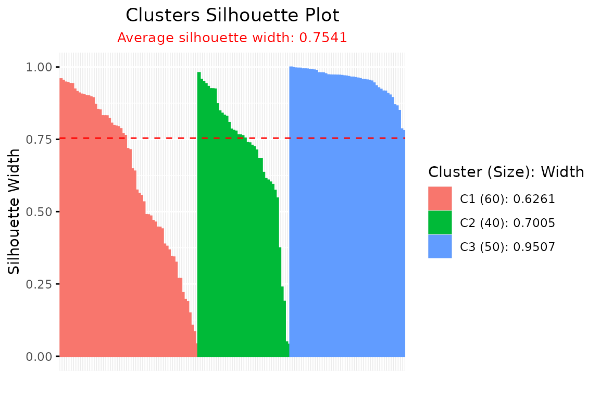

``` r


# Soft silhouette for FCM2
sil_fcm2 <- softSilhouette(prob_matrix = fcm2_result$u)
plot(sil_fcm2)
```

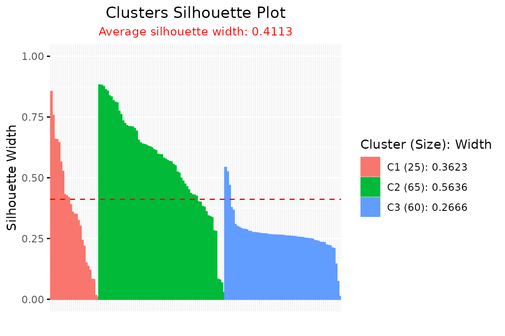

- **Step 3: Summarize and Compare Average Silhouette Widths**

  Extract the overall average silhouette width for each clustering
  result:

``` r

sfcm <- summary(sil_fcm, print.summary = FALSE)
sfcm2 <- summary(sil_fcm2, print.summary = FALSE)

cat("FCM average silhouette width:", sfcm$avg.width, "\n",
    "FCM2 average silhouette width:", sfcm2$avg.width)
#> FCM average silhouette width: 0.7541271 
#>  FCM2 average silhouette width: 0.411275
```

A higher average silhouette width indicates a clustering with more
compact and well-separated clusters.

**Interpretation & Guidance**

- **Interpret the Index**: The algorithm yielding a higher *average soft
  silhouette width* is considered to produce a better clustering, as it
  balances cluster cohesion and separation while accounting for the
  uncertainty inherent in soft assignments.
- **Practical Application**: This method is generic; any two or more
  soft clustering results (not limited to FCM/FCM2) can be compared
  effectively, provided you can extract the membership probability
  matrix.
- **Flexible Integration**: The
  [`softSilhouette()`](https://kskbhat.github.io/Silhouette/reference/softSilhouette.md)
  function also allows for different silhouette calculation methods and
  transformations (such as `prob_type = "nlpp"` for negative
  log-probabilities), supporting deeper comparisons aligned with your
  methodological framework.

**Additional Soft Clustering Methods**

The package also provides two additional methods for computing soft
silhouette widths:
[`cerSilhouette()`](https://kskbhat.github.io/Silhouette/reference/cerSilhouette.md)
(Certainty-based) and
[`dbSilhouette()`](https://kskbhat.github.io/Silhouette/reference/dbSilhouette.md)
(Density-based). These can be used in the same way as
[`softSilhouette()`](https://kskbhat.github.io/Silhouette/reference/softSilhouette.md)
to compare clustering algorithms.

``` r

# Certainty-based silhouette for FCM and FCM2
  cer_fcm <- cerSilhouette(prob_matrix = fcm_result$u, print.summary = TRUE)
#> ----------------------------------------------
#> Average crisp similarity db silhouette: 0.8572
#> ----------------------------------------------
#> 
#>   cluster size avg.sil.width
#> 1       1   60        0.7826
#> 2       2   40        0.8351
#> 3       3   50        0.9645
#> Available attributes: names, class, row.names, proximity_type, method, average
  plot(cer_fcm)
```

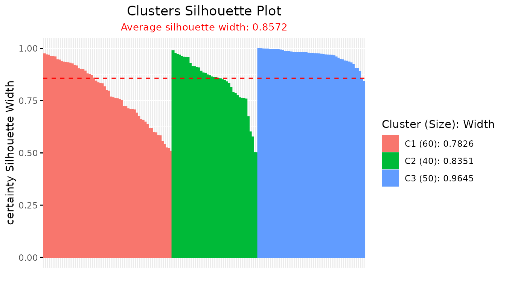

``` r

  
  cer_fcm2 <- cerSilhouette(prob_matrix = fcm2_result$u, print.summary = TRUE)
#> ----------------------------------------------
#> Average crisp similarity db silhouette: 0.6236
#> ----------------------------------------------
#> 
#>   cluster size avg.sil.width
#> 1       1   25        0.5974
#> 2       2   65        0.7135
#> 3       3   60        0.5371
#> Available attributes: names, class, row.names, proximity_type, method, average
  plot(cer_fcm2)
```

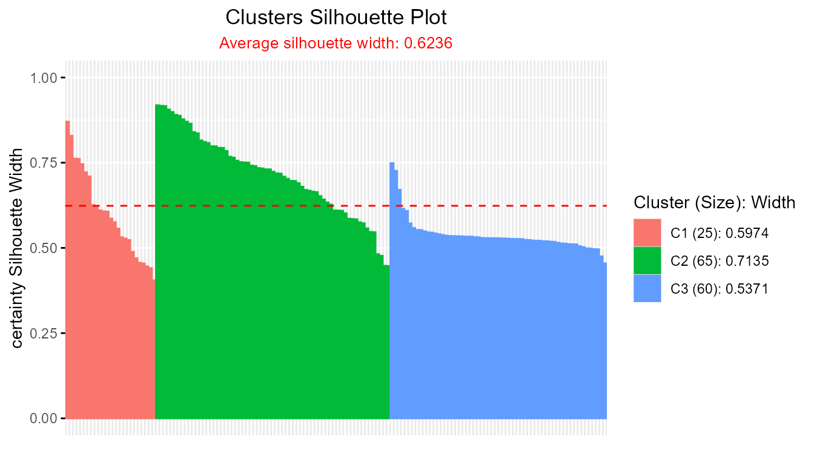

``` r


# Density-based silhouette for FCM and FCM2
  db_fcm <- dbSilhouette(prob_matrix = fcm_result$u, print.summary = TRUE)
#> ---------------------------------------
#> Median similarity db silhouette: 0.3098
#> ---------------------------------------
#> 
#>   cluster size avg.sil.width
#> 1       1   60        0.2225
#> 2       2   40        0.2456
#> 3       3   50        0.5074
#> Available attributes: names, class, row.names, proximity_type, method, average
  plot(db_fcm)
```

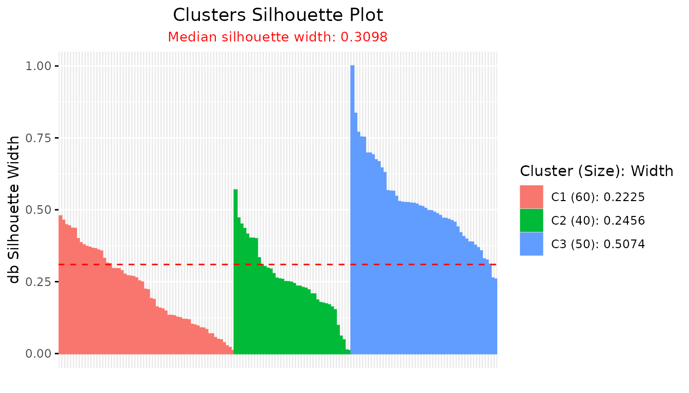

``` r

  
  db_fcm2 <- dbSilhouette(prob_matrix = fcm2_result$u, print.summary = TRUE)
#> ---------------------------------------
#> Median similarity db silhouette: 0.2607
#> ---------------------------------------
#> 
#>   cluster size avg.sil.width
#> 1       1   25        0.2642
#> 2       2   65        0.4942
#> 3       3   60        0.1943
#> Available attributes: names, class, row.names, proximity_type, method, average
  plot(db_fcm2)
```

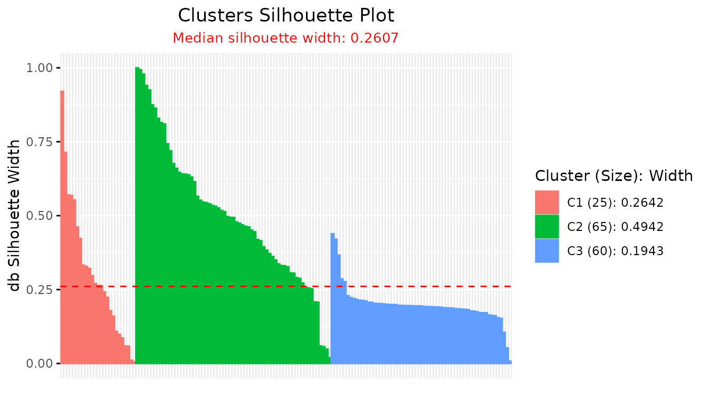

``` r

# Compare average silhouette widths across all methods
  # Summary for FCM
  cer_sfcm <- summary(cer_fcm, print.summary = FALSE)
  db_sfcm <- summary(db_fcm, print.summary = FALSE)
  
  # Summary for FCM2
  cer_sfcm2 <- summary(cer_fcm2, print.summary = FALSE)
  db_sfcm2 <- summary(db_fcm2, print.summary = FALSE)
  
  # Print comparison
  cat("FCM - Soft silhouette:", sfcm$avg.width, "\n",
      "FCM - Certainty silhouette:", cer_sfcm$avg.width, "\n",
      "FCM - Density-based silhouette:", db_sfcm$avg.width, 
      "\n\n","FCM2 - Soft silhouette:", sfcm2$avg.width, 
      "\n","FCM2 - Certainty silhouette:", cer_sfcm2$avg.width, 
      "\n","FCM2 - Density-based silhouette:", db_sfcm2$avg.width, "\n")
#> FCM - Soft silhouette: 0.7541271 
#>  FCM - Certainty silhouette: 0.8572481 
#>  FCM - Density-based silhouette: 0.3097745 
#> 
#>  FCM2 - Soft silhouette: 0.411275 
#>  FCM2 - Certainty silhouette: 0.6235972 
#>  FCM2 - Density-based silhouette: 0.2607283
```

**Summary:**  
Comparing the average soft silhouette widths from different soft
clustering algorithms provides an objective, data-driven basis for
determining which method produces more meaningful, well-defined clusters
in probabilistic settings. This approach harmonizes easily with both
classic fuzzy clustering and more advanced algorithms, and can be
extended to other soft silhouette methods like certainty-based and
density-based approaches.

### 3. Scree Plot for Optimal Number of Clusters

The scree plot (also called the “elbow plot” or “reverse elbow plot”) is
a practical tool for identifying the best number of clusters in
unsupervised learning. Here, the silhouette width is calculated for
different values of *k* (number of clusters). The resulting plot
provides a visual indication of the optimal cluster count by
highlighting where increasing *k* yields only marginal improvements in
the average silhouette width.

**Steps:**

- **Step 1: Compute Average Silhouette Widths at Varying Cluster
  Counts**  
  Run silhouette analysis across a range of possible cluster numbers
  (e.g., 2 to 7). For each *k*, use the any `Silhouette` class function
  to calculate the silhouette widths, then extract the average
  silhouette width from the summary.

``` r

data(iris)
avg_sil_width <- rep(NA,7)
for (k in 2:7) {
  sil_out <- Silhouette(
    prox_matrix = "d",
    method = "pac",
    clust_fun = ppclust::fcm,
    x = iris[, 1:4],
    centers = k)
  avg_sil_width[k] <- summary(sil_out, print.summary = FALSE)$avg.width
}
```

- **Step 2: Create and Interpret the Scree Plot**  
  Plot the number of clusters against the computed average silhouette
  widths:

``` r

plot(avg_sil_width,
  type = "o",
  ylab = "Overall Silhouette Width",
  xlab = "Number of Clusters",
  main = "Silhouette Scree Plot"
)
```


The optimal number of clusters is often suggested by the “elbow” or
“reverse elbow”—the point after which increases in *k* lead to
diminishing or excessive improvements in silhouette width. This visual
guide is valuable for assessing the clustering structure in your data.

*Note:* Any `Silhouette` class functions can be used to generate scree
plots for optimal cluster selection. For theoretical background and
additional diagnostic options for soft clustering, see Bhat Kapu and
Kiruthika (2024).

**Summary:**  
The scree plot provides an intuitive graphical summary to assist in
choosing the optimal number of clusters by plotting average silhouette
width versus the number of clusters considered. The integrated use of
[`Silhouette()`](https://kskbhat.github.io/Silhouette/reference/Silhouette.md),
[`softSilhouette()`](https://kskbhat.github.io/Silhouette/reference/softSilhouette.md),
[`cerSilhouette()`](https://kskbhat.github.io/Silhouette/reference/cerSilhouette.md),
[`dbSilhouette()`](https://kskbhat.github.io/Silhouette/reference/dbSilhouette.md)
use of `clust_fun` and summary functions makes this analysis
straightforward and efficient for both crisp and fuzzy clustering
frameworks. This method encourages a reproducible, objective approach to
cluster selection in unsupervised analysis.

### 4. Visualizing Silhouette Analysis Results with `plotSilhouette()`

Efficient visualization of silhouette widths is essential for
interpreting and diagnosing clustering quality. The
[`plotSilhouette()`](https://kskbhat.github.io/Silhouette/reference/plotSilhouette.md)
function provides a flexible and extensible tool for plotting silhouette
results from various clustering algorithms, supporting both hard (crisp)
and soft (fuzzy) partitions.

**Key Features:** - Accepts outputs from a wide range of clustering
methods: `Silhouette`, `softSilhouette`, `dbSilhouette`, `cerSilhouette`
as well as clustering objects from `cluster` (`pam`, `clara`, `fanny`,
base `silhouette`) and `factoextra` (`eclust`, `hcut`). - Offers
detailed legends summarizing average silhouette widths and cluster
sizes. - Supports customizable color palettes, including grayscale, and
the option to label observations on the x-axis.

**Illustrative Use Cases and Code**

- **Crisp Silhouette Visualization (e.g., k-means clustering):**

``` r

data(iris)
  km_out <- kmeans(iris[, -5], 3)
  dist_mat <- proxy::dist(iris[, -5], km_out$centers)
  sil_obj <- Silhouette(dist_mat)
  plot(sil_obj)                   # S3 method auto-dispatch
```

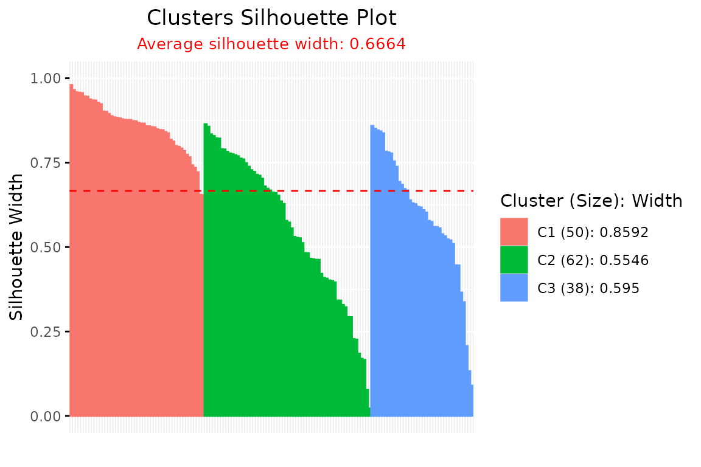

``` r

  plotSilhouette(sil_obj)         # explicit call (identical output)
```


- **Crisp Silhouette from Cluster Algorithms (PAM, CLARA, FANNY):**

``` r

library(cluster)
pam_result <- pam(iris[, 1:4], k = 3)
plotSilhouette(pam_result) # for cluster::pam object
```

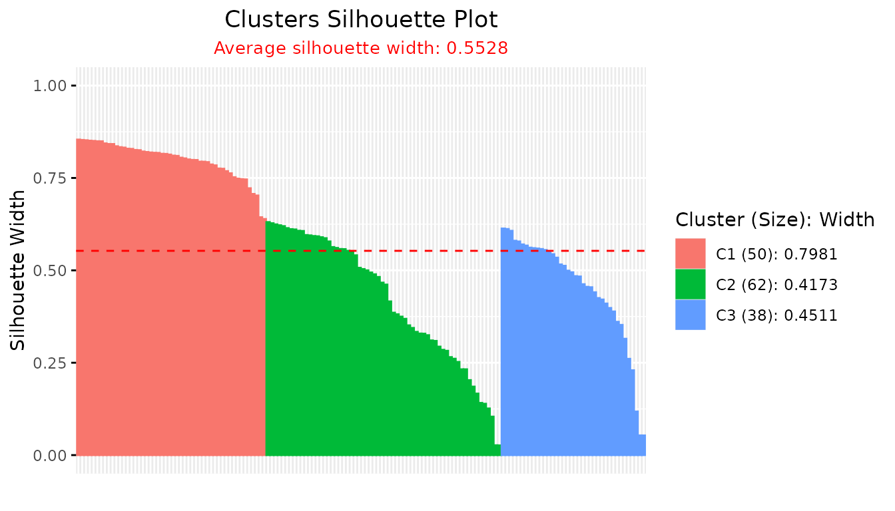

``` r


clara_result <- clara(iris[, 1:4], k = 3)
plotSilhouette(clara_result)
```

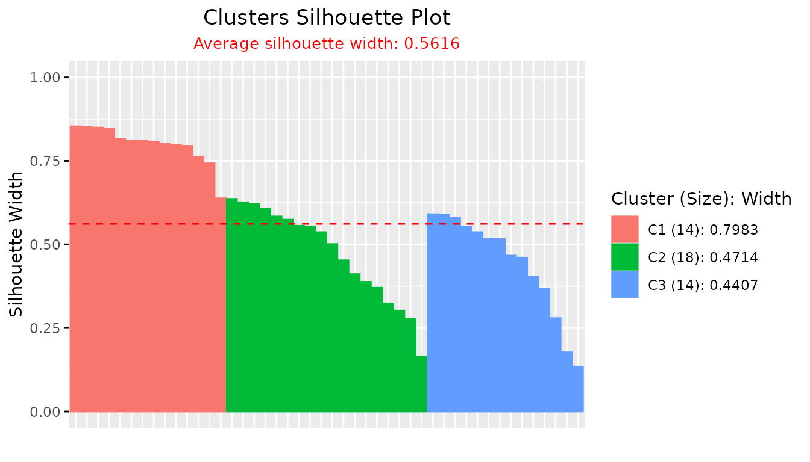

``` r


fanny_result <- fanny(iris[, 1:4], k = 3)
plotSilhouette(fanny_result)
```

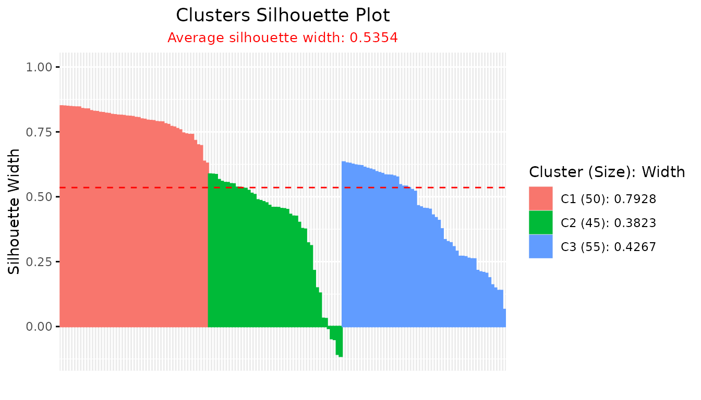

- **Base silhouette object:**

``` r

sil_base <- cluster::silhouette(pam_result)
plotSilhouette(sil_base)
```


- **factoextra::hcut/eclust clusterings:**

``` r

library(factoextra)
eclust_result <- eclust(iris[, 1:4], "kmeans", k = 3, graph = FALSE)
plotSilhouette(eclust_result)
```


``` r


hcut_result <- hcut(iris[, 1:4], k = 3)
plotSilhouette(hcut_result)
```

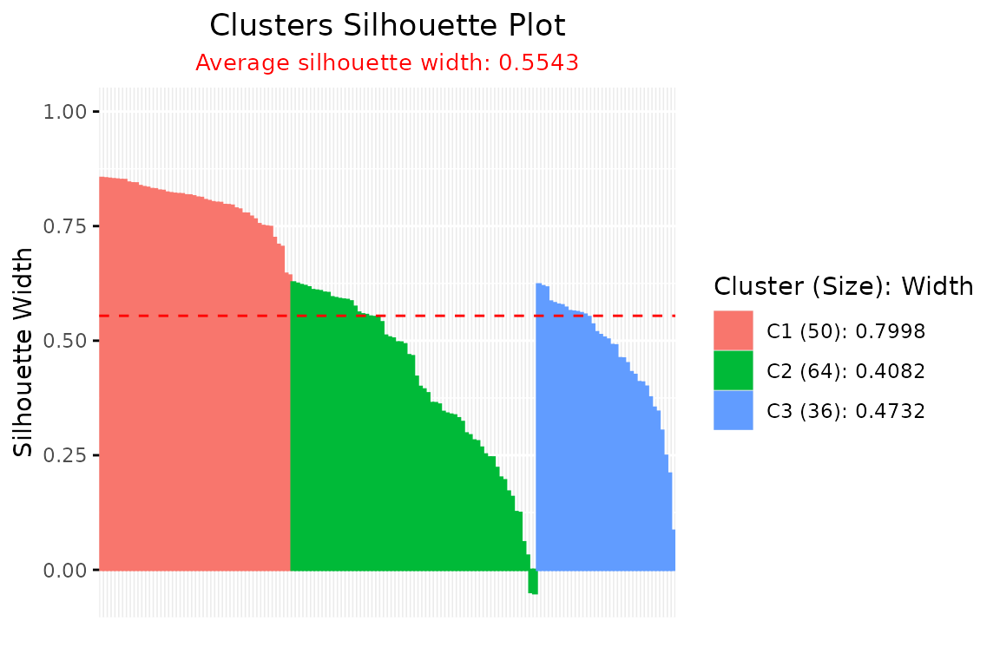

- **drclust::silhouette Visualization:**

``` r

library(drclust)
#> 
#> Attaching package: 'drclust'
#> The following object is masked from 'package:cluster':
#> 
#>     silhouette
# Loading the numeric in matrix 
iris_mat <- as.matrix(iris[,-5])
#applying a clustering algorithm
drclust_out <- dpcakm(iris_mat, 20, 3)
#silhouette based on the data and the output of the clustering algorithm
d <- silhouette(iris_mat, drclust_out)
#>    cluster size ave.sil.width
#> 1        1   20          0.17
#> 2        2   16          0.36
#> 3        3   12         -0.15
#> 4        4   10          0.08
#> 5        5   10         -0.06
#> 6        6    9          0.23
#> 7        7    8          0.36
#> 8        8    8          0.31
#> 9        9    8          0.16
#> 10      10    7          0.20
#> 11      11    6          0.17
#> 12      12    6          0.38
#> 13      13    6          0.18
#> 14      14    5          0.34
#> 15      15    4          0.10
#> 16      16    4          0.14
#> 17      17    4          0.19
#> 18      18    3          0.27
#> 19      19    3          0.18
#> 20      20    1          0.00
plotSilhouette(d$cl.silhouette)
```

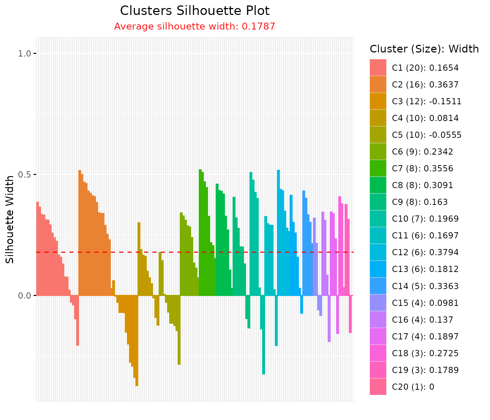

- **Fuzzy (Soft) Silhouette Visualization (e.g., fuzzy c-means with
  ppclust):**

``` r

data(iris)
fcm_out <- ppclust::fcm(iris[, 1:4], 3)
sil_fuzzy <- Silhouette(
  prox_matrix = "d", prob_matrix = "u", clust_fun = fcm,
  x = iris[, 1:4], centers = 3, sort = TRUE
)
plot(sil_fuzzy, summary.legend = FALSE, grayscale = TRUE)
```

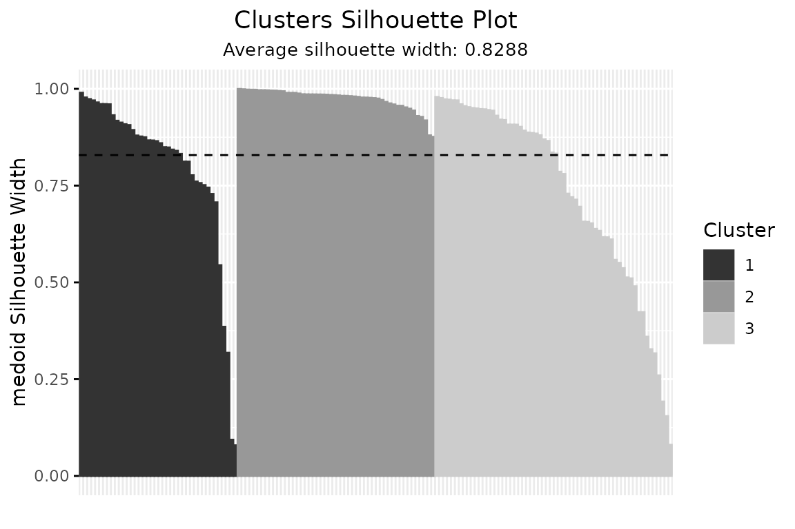

- **Customization: Grayscale, Detailed Legends, and Observation
  Labels:**

``` r

plotSilhouette(sil_fuzzy, grayscale = TRUE) # Use grayscale palette
```

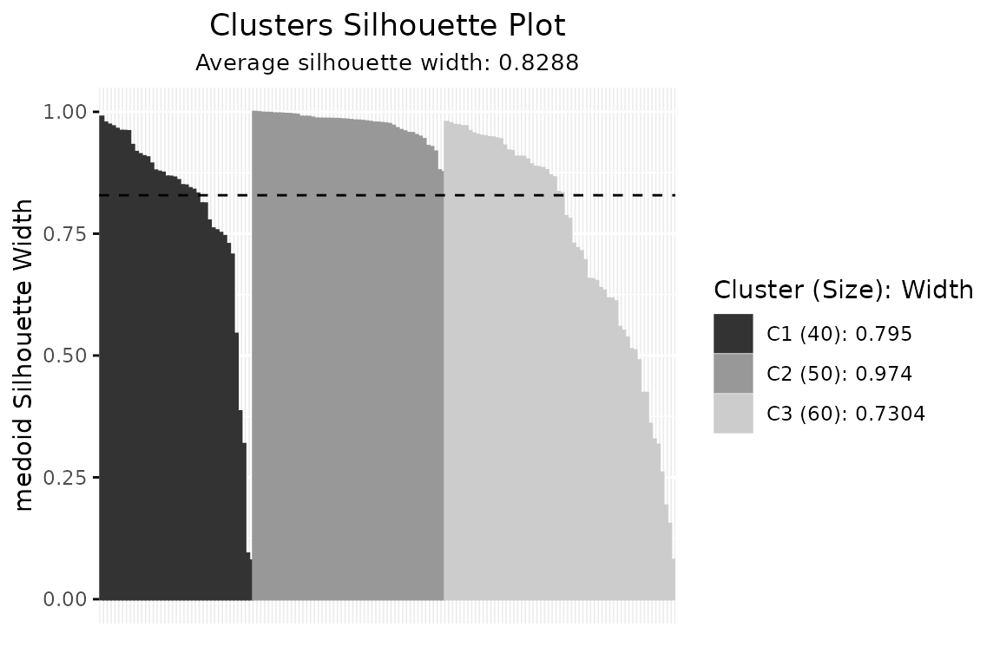

``` r

plotSilhouette(sil_fuzzy, summary.legend = TRUE) # Include size + avg silhouette in legend
```

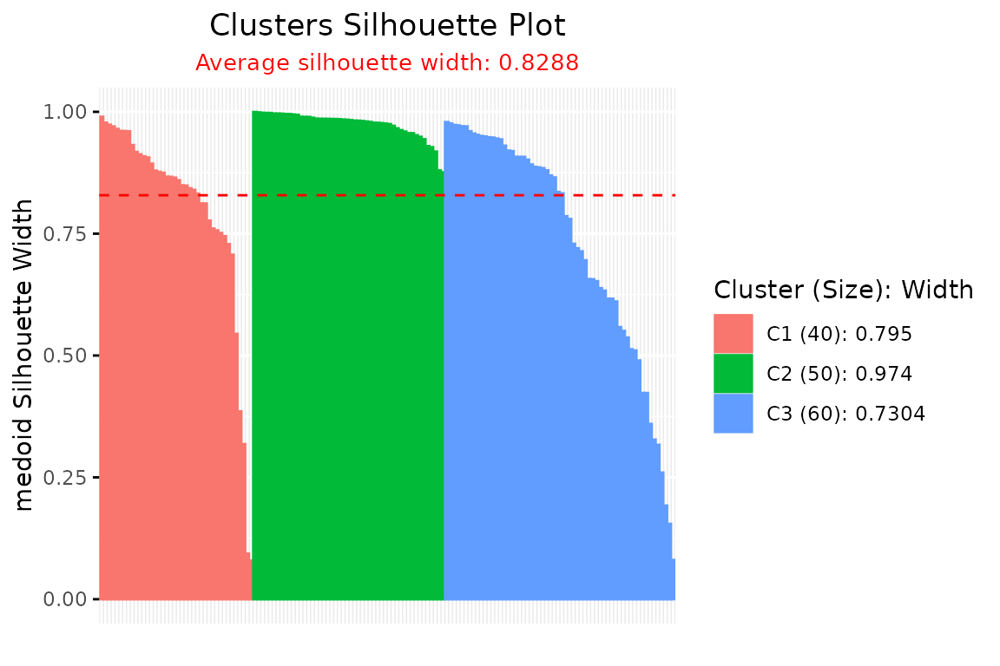

``` r

plotSilhouette(sil_fuzzy, label = TRUE) # Label bars with row index
```

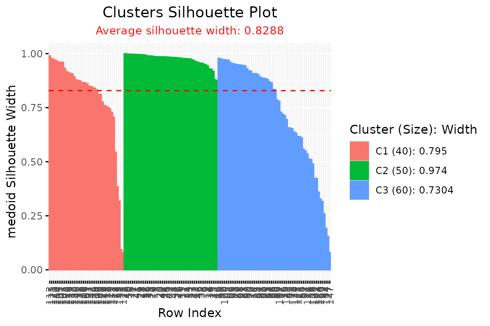

**Practical Guidance:** - For clustering output classes not supported by
the generic [`plot()`](https://rdrr.io/r/graphics/plot.default.html)
function, always use
[`plotSilhouette()`](https://kskbhat.github.io/Silhouette/reference/plotSilhouette.md)
explicitly to ensure correct and informative visualization. - The
function automatically sorts silhouette widths within clusters, displays
the average silhouette (dashed line), and provides detailed cluster
summaries in the legend.

**Summary:**  
[`plotSilhouette()`](https://kskbhat.github.io/Silhouette/reference/plotSilhouette.md)
brings unified, publication-ready visualization capabilities for
assessing crisp and fuzzy clustering at a glance. Its broad
compatibility, detailed legends, grayscale and labeling options empower
users to gain deeper insights into clustering structure, facilitating
clear diagnosis and reporting in both exploratory and formal statistical
workflows.

### 5. Creating and Validating User-Defined Silhouette Objects

The
[`getSilhouette()`](https://kskbhat.github.io/Silhouette/reference/getSilhouette.md)
function enables users to manually construct a `Silhouette` object from
precomputed cluster assignments, neighbor clusters, silhouette widths,
and optional weights. This is particularly useful for custom or
externally derived clustering results.

The
[`is.Silhouette()`](https://kskbhat.github.io/Silhouette/reference/is.Silhouette.md)
function validates whether an object is a valid `Silhouette` object,
ensuring it meets the necessary structural and attribute requirements
for visualization and analysis.

Example:

``` r

# Create a custom Silhouette object
cluster_assignments <- c(1, 1, 2, 2, 3, 3)
neighbor_clusters <- c(2, 2, 1, 1, 1, 1)
silhouette_widths <- c(0.8, 0.7, 0.6, 0.9, 0.5, 0.4)
weights <- c(0.9, 0.8, 0.7, 0.95, 0.6, 0.5)

sil_custom <- getSilhouette(
  cluster = cluster_assignments,
  neighbor = neighbor_clusters,
  sil_width = silhouette_widths,
  weight = weights,
  proximity_type = "similarity",
  method = "pac",
  average = "fuzzy"
)
# Validate the object
is.Silhouette(sil_custom)               # Basic class check: TRUE
#> [1] TRUE
is.Silhouette(sil_custom, strict = TRUE) # Strict structural validation: TRUE
#> [1] TRUE
is.Silhouette(data.frame(a = 1:6))      # Non-Silhouette object: FALSE
#> [1] FALSE
# Visualize the custom Silhouette object
plotSilhouette(sil_custom, summary.legend = TRUE)
```

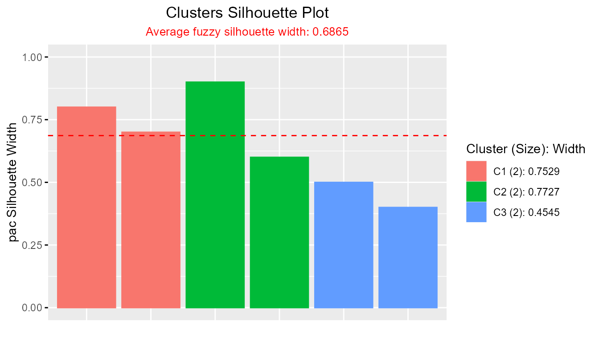

This approach allows users to integrate custom silhouette computations
into the **Silhouette** package’s visualization framework, ensuring
flexibility for specialized workflows while maintaining compatibility
with
[`plotSilhouette()`](https://kskbhat.github.io/Silhouette/reference/plotSilhouette.md).

### 6. Comprehensive Comparison of All Silhouette Methods with `calSilhouette()`

The
[`calSilhouette()`](https://kskbhat.github.io/Silhouette/reference/calSilhouette.md)
function provides a streamlined approach to compute and compare all
available silhouette methods from the package in a single call. This
function is particularly useful for:

- Comparing multiple silhouette computation methods simultaneously
- Evaluating clustering quality across different averaging approaches
  (crisp, fuzzy, median)
- Rapid assessment of clustering performance using various silhouette
  formulations

**Key Features:** - Automatically computes all compatible silhouette
methods based on available input matrices - Returns a comprehensive
summary data frame comparing crisp, fuzzy, and median silhouette
values - Supports both direct matrix input and clustering function
output - Computes up to 11 different silhouette methods when both
proximity and probability matrices are provided

**Available Methods:**

When **proximity matrix** is provided: - `medoid` - Medoid-based
silhouette - `pac` - PAC-based silhouette

When **probability matrix** is provided: - `pp_pac`, `pp_medoid` -
Posterior probabilities with PAC/Medoid methods - `nlpp_pac`,
`nlpp_medoid` - Negative log posterior probabilities with PAC/Medoid
methods - `pd_pac`, `pd_medoid` - Probability distribution with
PAC/Medoid methods - `cer` - Certainty-based silhouette - `db` -
Density-based silhouette

#### a. Comprehensive Method Comparison Using Clustering Function

This example demonstrates how to use
[`calSilhouette()`](https://kskbhat.github.io/Silhouette/reference/calSilhouette.md)
with a clustering function to automatically compute all available
silhouette methods:

``` r

library(ppclust)
data(iris)

# Compute all silhouette methods using FCM clustering
summary_result <- calSilhouette(
  prox_matrix = "d",
  prob_matrix = "u",
  proximity_type = "dissimilarity",
  clust_fun = ppclust::fcm,
  x = iris[, -5],
  centers = 3,
  print.summary = TRUE
)
#> 
#> Summary of All Silhouette Methods
#> ========================================== 
#>       Method     Crisp     Fuzzy    Median
#>       medoid 0.8288288 0.9297577 0.9179945
#>          pac 0.7541271 0.8799106 0.8484197
#>       pp_pac 0.7541271 0.8799106 0.8484197
#>    pp_medoid 0.8288288 0.9297577 0.9179945
#>     nlpp_pac 0.8185224 0.9304926 0.9261387
#>  nlpp_medoid 0.8749545 0.9604788 0.9616532
#>       pd_pac 0.7469894 0.8786105 0.8562152
#>    pd_medoid 0.8196600 0.9280044 0.9225377
#>          cer 0.8572481 0.9248327 0.9041529
#>           db 0.3303585 0.4206051 0.3097745

# View the results
head(summary_result)
#>        Method     Crisp     Fuzzy    Median
#> 1      medoid 0.8288288 0.9297577 0.9179945
#> 2         pac 0.7541271 0.8799106 0.8484197
#> 3      pp_pac 0.7541271 0.8799106 0.8484197
#> 4   pp_medoid 0.8288288 0.9297577 0.9179945
#> 5    nlpp_pac 0.8185224 0.9304926 0.9261387
#> 6 nlpp_medoid 0.8749545 0.9604788 0.9616532
```

#### b. Method Comparison Using Output Proximity Matrices

When clustering has already been performed, you can directly use the
output matrices:

``` r

# Perform clustering first
fcm_result <- ppclust::fcm(iris[, -5], centers = 3)

# Compute all silhouette methods using the clustering output
summary_direct <- calSilhouette(
  prox_matrix = fcm_result$d,
  prob_matrix = fcm_result$u,
  proximity_type = "dissimilarity",
  a = 2,
  print.summary = TRUE
)
#> 
#> Summary of All Silhouette Methods
#> ========================================== 
#>       Method     Crisp     Fuzzy    Median
#>       medoid 0.8288288 0.9297577 0.9179945
#>          pac 0.7541271 0.8799106 0.8484197
#>       pp_pac 0.7541271 0.8799106 0.8484197
#>    pp_medoid 0.8288288 0.9297577 0.9179945
#>     nlpp_pac 0.8185224 0.9304926 0.9261387
#>  nlpp_medoid 0.8749545 0.9604788 0.9616532
#>       pd_pac 0.7469894 0.8786105 0.8562152
#>    pd_medoid 0.8196600 0.9280044 0.9225377
#>          cer 0.8572481 0.9248327 0.9041529
#>           db 0.3303585 0.4206051 0.3097745

# Access specific results
head(summary_direct)
#>        Method     Crisp     Fuzzy    Median
#> 1      medoid 0.8288288 0.9297577 0.9179945
#> 2         pac 0.7541271 0.8799106 0.8484197
#> 3      pp_pac 0.7541271 0.8799106 0.8484197
#> 4   pp_medoid 0.8288288 0.9297577 0.9179945
#> 5    nlpp_pac 0.8185224 0.9304926 0.9261387
#> 6 nlpp_medoid 0.8749545 0.9604788 0.9616532
```

#### c. Comparing Clustering Algorithms Using `calSilhouette()`

A powerful application of
[`calSilhouette()`](https://kskbhat.github.io/Silhouette/reference/calSilhouette.md)
is comparing multiple clustering algorithms across all silhouette
methods:

``` r

# Compare FCM and FCM2 algorithms
fcm_summary <- calSilhouette(
  prox_matrix = "d",
  prob_matrix = "u",
  proximity_type = "dissimilarity",
  clust_fun = ppclust::fcm,
  x = iris[, -5],
  centers = 3,
  print.summary = FALSE
)

fcm2_summary <- calSilhouette(
  prox_matrix = "d",
  prob_matrix = "u",
  proximity_type = "dissimilarity",
  clust_fun = ppclust::fcm2,
  x = iris[, -5],
  centers = 3,
  print.summary = FALSE
)

# Create comparison data frame
comparison <- data.frame(
  Method = fcm_summary$Method,
  FCM_Crisp = fcm_summary$Crisp,
  FCM2_Crisp = fcm2_summary$Crisp,
  FCM_Fuzzy = fcm_summary$Fuzzy,
  FCM2_Fuzzy = fcm2_summary$Fuzzy,
  stringsAsFactors = FALSE
)

print(comparison)
#>         Method FCM_Crisp FCM2_Crisp FCM_Fuzzy FCM2_Fuzzy
#> 1       medoid 0.8288288  0.7206930 0.9297577  0.8479789
#> 2          pac 0.7541271  0.5999638 0.8799106  0.7542894
#> 3       pp_pac 0.7541271  0.5999638 0.8799106  0.7542894
#> 4    pp_medoid 0.8288288  0.7206930 0.9297577  0.8479789
#> 5     nlpp_pac 0.8185224  0.6742534 0.9304926  0.8237430
#> 6  nlpp_medoid 0.8749545  0.7779250 0.9604788  0.8949072
#> 7       pd_pac 0.7469894  0.4433879 0.8786105  0.5632048
#> 8    pd_medoid 0.8196600  0.5848153 0.9280044  0.6917540
#> 9          cer 0.8572481  0.7458604 0.9248327  0.8353375
#> 10          db 0.3303585  0.3522426 0.4206051  0.4908605
```

#### d. Visualizing Method Comparisons

Visualize the comparison across different methods and averaging
approaches:

``` r

library(ggplot2)
library(tidyr)

# Reshape data for plotting
comparison_long <- tidyr::pivot_longer(
  comparison,
  cols = -Method,
  names_to = "Algorithm_Type",
  values_to = "Silhouette_Width"
)

# Create grouped bar plot
ggplot(comparison_long, aes(x = Method, y = Silhouette_Width, fill = Algorithm_Type)) +
  geom_bar(stat = "identity", position = "dodge") +
  theme_minimal() +
  theme(
    axis.text.x = element_text(angle = 45, hjust = 1, size = 10),
    legend.position = "bottom"
  ) +
  labs(
    title = "Comparison of Silhouette Methods: FCM vs FCM2",
    x = "Silhouette Method",
    y = "Average Silhouette Width",
    fill = "Algorithm & Type"
  ) +
  scale_fill_brewer(palette = "Set2") +
  geom_hline(yintercept = 0, linetype = "dashed", color = "gray40")
```

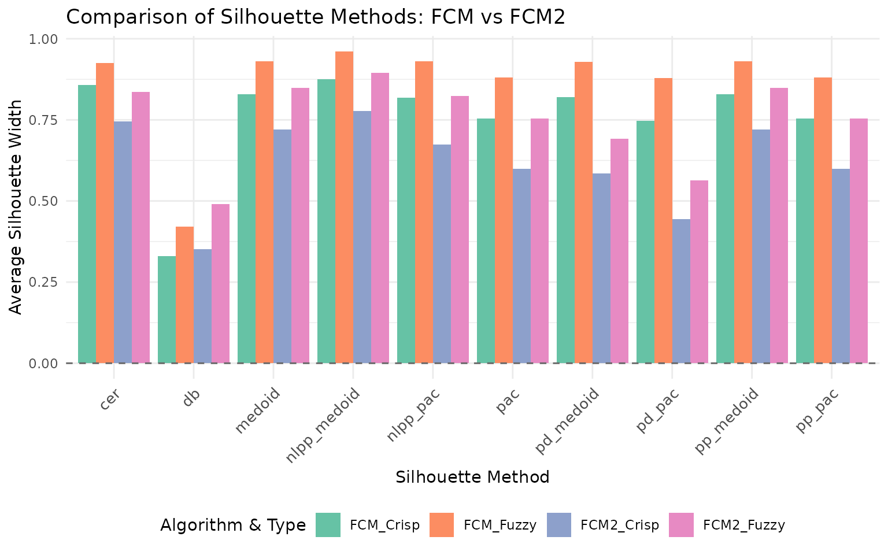

#### e. Selecting Optimal Number of Clusters Using `calSilhouette()`

Use
[`calSilhouette()`](https://kskbhat.github.io/Silhouette/reference/calSilhouette.md)
to evaluate clustering quality across different numbers of clusters:

``` r

# Compute silhouette summaries for k = 2 to 6
k_range <- 2:6
results_list <- list()

for (k in k_range) {
  results_list[[as.character(k)]] <- calSilhouette(
    prox_matrix = "d",
    prob_matrix = "u",
    proximity_type = "dissimilarity",
    clust_fun = ppclust::fcm,
    x = iris[, -5],
    centers = k,
    print.summary = FALSE
  )
}

# Extract crisp pac method silhouette widths for comparison
pac_widths <- sapply(results_list, function(x) x$Crisp[x$Method == "pac"])

# Plot optimal k selection
plot(k_range, pac_widths,
  type = "o", pch = 19,
  xlab = "Number of Clusters (k)",
  ylab = "Average Silhouette Width (PAC method)",
  main = "Optimal Cluster Selection using calSilhouette()",
  col = "steelblue", lwd = 2,
  ylim = c(min(pac_widths) * 0.95, max(pac_widths) * 1.05)
)
grid()
abline(h = max(pac_widths), lty = 2, col = "red")
text(k_range[which.max(pac_widths)], max(pac_widths), 
     labels = paste("Optimal k =", k_range[which.max(pac_widths)]), 
     pos = 3, col = "red")
```

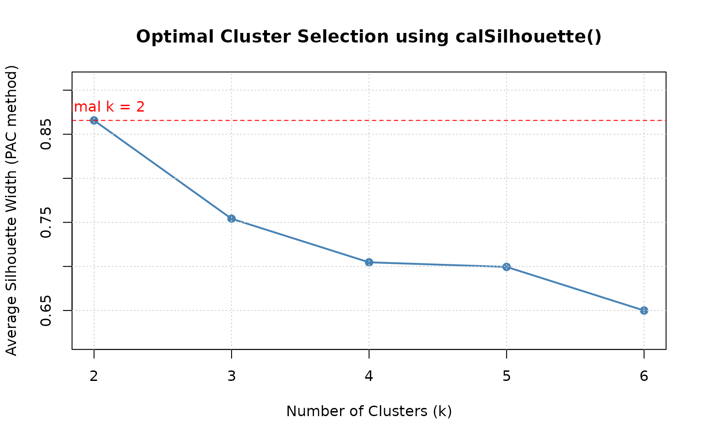

#### f. Method-Specific Analysis

Extract and analyze specific methods from the comprehensive summary:

``` r

# Get all pac-based methods
pac_methods <- summary_result[grep("pac", summary_result$Method), ]
cat("PAC-based methods:\n")
#> PAC-based methods:
print(pac_methods, row.names = FALSE)
#>    Method     Crisp     Fuzzy    Median
#>       pac 0.7541271 0.8799106 0.8484197
#>    pp_pac 0.7541271 0.8799106 0.8484197
#>  nlpp_pac 0.8185224 0.9304926 0.9261387
#>    pd_pac 0.7469894 0.8786105 0.8562152

# Get all medoid-based methods
medoid_methods <- summary_result[grep("medoid", summary_result$Method), ]
cat("\nMedoid-based methods:\n")
#> 
#> Medoid-based methods:
print(medoid_methods, row.names = FALSE)
#>       Method     Crisp     Fuzzy    Median
#>       medoid 0.8288288 0.9297577 0.9179945
#>    pp_medoid 0.8288288 0.9297577 0.9179945
#>  nlpp_medoid 0.8749545 0.9604788 0.9616532
#>    pd_medoid 0.8196600 0.9280044 0.9225377

# Get probability-based methods (cer, db)
prob_methods <- summary_result[summary_result$Method %in% c("cer", "db"), ]
cat("\nProbability-based methods (cer, db):\n")
#> 
#> Probability-based methods (cer, db):
print(prob_methods, row.names = FALSE)
#>  Method     Crisp     Fuzzy    Median
#>     cer 0.8572481 0.9248327 0.9041529
#>      db 0.3303585 0.4206051 0.3097745

# Compare crisp vs fuzzy vs median averaging
cat("\n=== Best Methods by Averaging Type ===\n")
#> 
#> === Best Methods by Averaging Type ===
cat("Best method by crisp averaging:", 
    summary_result$Method[which.max(summary_result$Crisp)], 
    "(", round(max(summary_result$Crisp, na.rm = TRUE), 4), ")\n")
#> Best method by crisp averaging: nlpp_medoid ( 0.875 )
cat("Best method by fuzzy averaging:", 
    summary_result$Method[which.max(summary_result$Fuzzy)], 
    "(", round(max(summary_result$Fuzzy, na.rm = TRUE), 4), ")\n")
#> Best method by fuzzy averaging: nlpp_medoid ( 0.9605 )
cat("Best method by median averaging:", 
    summary_result$Method[which.max(summary_result$Median)], 
    "(", round(max(summary_result$Median, na.rm = TRUE), 4), ")\n")
#> Best method by median averaging: nlpp_medoid ( 0.9617 )
```

#### g. Comparing Only Proximity-Based Methods

When only the proximity matrix is available (e.g., for crisp
clustering),
[`calSilhouette()`](https://kskbhat.github.io/Silhouette/reference/calSilhouette.md)
automatically computes only the applicable methods:

``` r

library(proxy)
data(iris)

# K-means clustering (crisp clustering)
km <- kmeans(iris[, -5], centers = 3)

# Compute distance matrix
dist_matrix <- proxy::dist(iris[, -5], km$centers)

# Compute only proximity-based silhouettes (medoid and pac)
crisp_summary <- calSilhouette(
  prox_matrix = dist_matrix,
  proximity_type = "dissimilarity",
  print.summary = TRUE
)
#> 
#> Summary of All Silhouette Methods
#> ========================================== 
#>  Method     Crisp    Median
#>  medoid 0.6663856 0.7254804
#>     pac 0.5375927 0.5692253

# View results (note: no Fuzzy column since prob_matrix not provided)
print(crisp_summary)
#>   Method     Crisp    Median
#> 1 medoid 0.6663856 0.7254804
#> 2    pac 0.5375927 0.5692253
```

#### h. Heatmap Visualization of Method Comparisons

Create a heatmap to visualize performance across methods and averaging
types:

``` r

library(ggplot2)
library(tidyr)

# Reshape data for heatmap
heatmap_data <- tidyr::pivot_longer(
  summary_result,
  cols = c(Crisp, Fuzzy, Median),
  names_to = "Average_Type",
  values_to = "Silhouette_Width"
)

# Create heatmap
ggplot(heatmap_data, aes(x = Average_Type, y = Method, fill = Silhouette_Width)) +
  geom_tile(color = "white") +
  geom_text(aes(label = round(Silhouette_Width, 3)), color = "black", size = 3) +
  scale_fill_gradient2(
    low = "red", mid = "yellow", high = "green",
    midpoint = median(heatmap_data$Silhouette_Width, na.rm = TRUE),
    na.value = "gray90"
  ) +
  theme_minimal() +
  theme(
    axis.text.x = element_text(angle = 0, hjust = 0.5),
    axis.text.y = element_text(size = 10),
    legend.position = "right"
  ) +
  labs(
    title = "Silhouette Width Heatmap Across Methods and Averaging Types",
    x = "Averaging Type",
    y = "Silhouette Method",
    fill = "Silhouette\nWidth"
  )
```

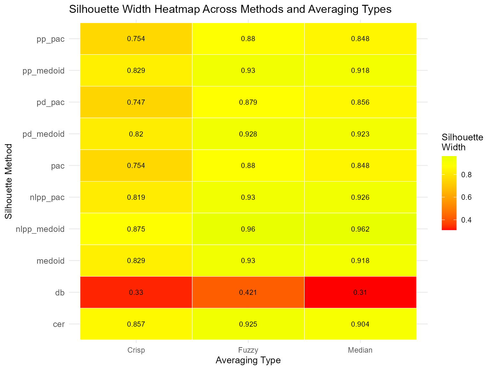

**Practical Guidance:**

- Use
  [`calSilhouette()`](https://kskbhat.github.io/Silhouette/reference/calSilhouette.md)
  when you need a comprehensive overview of clustering quality across
  multiple methodological perspectives
- The function is especially useful for algorithm comparison studies and
  sensitivity analyses
- Different methods may highlight different aspects of cluster quality;
  examining multiple methods provides a more robust assessment
- For crisp clustering (when only proximity matrix is available), the
  function automatically computes only the applicable methods (medoid,
  pac)
- The `a` parameter controls the fuzzifier for weighted averaging in
  fuzzy methods (default = 2)
- Consider using heatmaps or grouped bar plots to visualize method
  comparisons effectively
- When selecting optimal number of clusters, examine multiple methods
  rather than relying on a single metric

**Interpretation Guidelines:**

- **Crisp averaging**: Unweighted average, treats all observations
  equally
- **Fuzzy averaging**: Weighted by membership probabilities, emphasizes
  observations with stronger cluster membership
- **Median averaging**: Robust to outliers, provides stable estimates in
  the presence of extreme values
- **PAC methods**: More penalized, conservative estimates of cluster
  quality
- **Medoid methods**: Less penalized, may be more optimistic about
  cluster separation
- **Density-based (db)**: Considers log-ratios of posterior
  probabilities, good for identifying density-based cluster structure
- **Certainty-based (cer)**: Uses maximum posterior probabilities,
  emphasizes confidence in cluster assignments

**Summary:**

[`calSilhouette()`](https://kskbhat.github.io/Silhouette/reference/calSilhouette.md)
provides a powerful, unified interface for comprehensive silhouette
analysis, enabling researchers to evaluate clustering solutions from
multiple perspectives simultaneously. This function streamlines
comparative studies, supports robust cluster validation, and facilitates
reproducible clustering diagnostics across different algorithms and
parameter settings. Its integration with the package’s visualization
capabilities makes it an essential tool for thorough clustering quality
assessment in both crisp and soft clustering contexts.## 7. Extended
Silhouette Analysis for Multi-Way Clustering

The
[`extSilhouette()`](https://kskbhat.github.io/Silhouette/reference/extSilhouette.md)
function enables silhouette-based evaluation for multi-way clustering
scenarios, such as biclustering or tensor clustering, by aggregating
silhouette indices from each mode (e.g., rows, columns) into a single
summary metric. This approach allows you to rigorously assess the
overall clustering structure when partitioning data along multiple
dimensions.

**Workflow:**

- **Step 1: Generate Mock Two-Way Membership Probability Matrices**  
  Suppose we have partitioned a dataset along two modes (e.g., rows and
  columns of a matrix) using a biclustering algorithm. Let the row
  clustering result in membership probabilities for 150 observations
  across 3 clusters, and the column clustering result in probabilities
  for 4 variables across 2 clusters.

``` r

set.seed(123)
# Mock row clustering posterior probabilities (150 observations, 3 clusters)
prob_mode1 <- matrix(runif(150 * 3), nrow = 150, ncol = 3)
prob_mode1 <- prob_mode1 / rowSums(prob_mode1)

# Mock column clustering posterior probabilities (4 variables, 2 clusters)
prob_mode2 <- matrix(runif(4 * 2), nrow = 4, ncol = 2)
prob_mode2 <- prob_mode2 / rowSums(prob_mode2)
```

- **Step 2: Compute Silhouette Widths for Each Mode**  
  For each dimension (e.g., rows and columns), calculate silhouette
  widths using the membership probability matrices via the
  [`softSilhouette()`](https://kskbhat.github.io/Silhouette/reference/softSilhouette.md)
  function:

``` r

sil_mode1 <- softSilhouette(
  prob_matrix = prob_mode1,
  method = "pac",
  print.summary = FALSE
)
sil_mode2 <- softSilhouette(
  prob_matrix = prob_mode2,
  method = "pac",
  print.summary = FALSE
)
```

- **Step 3: Aggregate Silhouette Results with
  [`extSilhouette()`](https://kskbhat.github.io/Silhouette/reference/extSilhouette.md)**  
  Combine the silhouette analyses from each mode by passing them as a
  list to
  [`extSilhouette()`](https://kskbhat.github.io/Silhouette/reference/extSilhouette.md).
  Optionally, provide descriptive dimension names:

``` r

ext_sil <- extSilhouette(
  sil_list = list(sil_mode1, sil_mode2),
  dim_names = c("Rows", "Columns"),
  print.summary = TRUE
)
#> ---------------------------
#> Extended silhouette: 0.2202 
#> ---------------------------
#> Dimension Summary:
#>   dimension n_obs avg_sil_width
#> 1      Rows   150        0.2113
#> 2   Columns     4        0.5530
#> 
#> Available components:
#> [1] "ext_sil_width" "dim_table"
```

**Summary:**  
The
[`extSilhouette()`](https://kskbhat.github.io/Silhouette/reference/extSilhouette.md)
function returns: - The overall extended silhouette width—a weighted
average summarizing clustering quality across all modes. - A dimension
statistics table, reporting the number of observations and average
silhouette width for each mode (e.g., rows, columns).

*Note:*  If a distance matrix is available from the output of a
biclustering algorithm, you can compute individual mode silhouettes
using
[`Silhouette()`](https://kskbhat.github.io/Silhouette/reference/Silhouette.md).

The results can be combined with
[`extSilhouette()`](https://kskbhat.github.io/Silhouette/reference/extSilhouette.md)
to enable direct comparison of clustering solutions across multiple
biclustering algorithms, facilitating objective model assessment (Kapu
and C 2025).

This methodology provides a concise and interpretable assessment for
complex clustering models where conventional one-dimensional indices are
insufficient.

## References

Bhat Kapu, S., and Kiruthika. 2024. “Some Density-Based Silhouette
Diagnostics for Soft Clustering Algorithms.” *Communications in
Statistics: Case Studies, Data Analysis and Applications* 10 (3-4):
221–38. <https://doi.org/10.1080/23737484.2024.2408534>.

Campello, R. J., and E. R. Hruschka. 2006. “A Fuzzy Extension of the
Silhouette Width Criterion for Cluster Analysis.” *Fuzzy Sets and
Systems* 157 (21): 2858–75. <https://doi.org/10.1016/j.fss.2006.07.006>.

Kapu, Shrikrishna Bhat, and Kiruthika C. 2025. *Block Probabilistic
Distance Clustering: A Unified Framework and Evaluation*. Version 1.
<https://doi.org/10.21203/rs.3.rs-6973596/v1>.

Menardi, Giovanna. 2011. “Density-Based Silhouette Diagnostics for
Clustering Methods.” *Statistics and Computing* 21 (3): 295–308.
<https://doi.org/10.1007/s11222-010-9169-0>.

Raymaekers, J., and P. J. Rousseeuw. 2022. “Silhouettes and Quasi
Residual Plots for Neural Nets and Tree-Based Classifiers.” *Journal of
Computational and Graphical Statistics* 31 (4): 1332–43.
<https://doi.org/10.1080/10618600.2022.2050249>.

Rousseeuw, P. J. 1987. “Silhouettes: A Graphical Aid to the
Interpretation and Validation of Cluster Analysis.” *Journal of
Computational and Applied Mathematics* 20: 53–65.
<https://doi.org/10.1016/0377-0427(87)90125-7>.

Schepers, J., E. Ceulemans, and I. Van Mechelen. 2008. “Selecting Among
Multi-Mode Partitioning Models of Different Complexities: A Comparison
of Four Model Selection Criteria.” *Journal of Classification* 25 (1):
67–85. <https://doi.org/10.1007/s00357-008-9005-9>.

Van der Laan, M., K. Pollard, and J. Bryan. 2003. “A New Partitioning
Around Medoids Algorithm.” *Journal of Statistical Computation and
Simulation* 73 (8): 575–84.
<https://doi.org/10.1080/0094965031000136012>.
